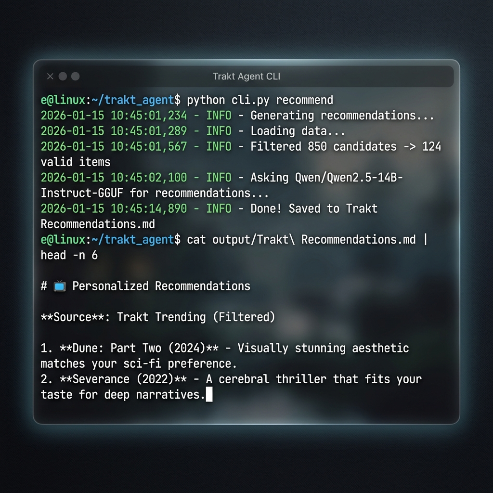

# Trakt Recommendation Agent

[](https://opensource.org/licenses/MIT)
[](https://www.python.org/downloads/)
[](https://github.com/psf/black)
[](https://github.com/yourusername/trakt-agent)

An intelligent, privacy-focused TV and movie recommendation system powered by your Trakt.tv watch history and a local GPU-accelerated Large Language Model (LLM). This tool analyzes your viewing habits to generate personalized recommendations without sending your data to third-party AI services.



## Table of Contents

- [Trakt Recommendation Agent](#trakt-recommendation-agent)
  - [Table of Contents](#table-of-contents)
  - [Overview](#overview)
  - [Repository Structure](#repository-structure)
  - [Prerequisites](#prerequisites)
  - [Installation](#installation)
    - [1. Clone or Download](#1-clone-or-download)
    - [2. Set Up Virtual Environment](#2-set-up-virtual-environment)
    - [3. Install Dependencies](#3-install-dependencies)
    - [4. Configure Credentials](#4-configure-credentials)
    - [5. Authenticate with Trakt](#5-authenticate-with-trakt)
  - [Configuration](#configuration)
    - [Local LLM Setup](#local-llm-setup)
    - [User Preferences](#user-preferences)
  - [Usage Guide](#usage-guide)
    - [Basic Workflow](#basic-workflow)
    - [Advanced Features](#advanced-features)
  - [Troubleshooting](#troubleshooting)
  - [Contributing](#contributing)
  - [License](#license)

## Overview

The Trakt Recommendation Agent offers a personalized discovery experience by combining structured data from Trakt with the semantic understanding of modern LLMs.

**Key Features:**

- **Privacy-First**: Uses a local LLM (OpenAI-compatible) for all reasoning; your detailed history stays local.
- **Smart Filtering**: Automatically excludes watched items, works with release year constraints, and respects genre exclusions.
- **Taste Profiling**: Generates a psychological profile of your media preferences based on your history.
- **Flexible Interactions**: Supports "seeding" recommendations with specific titles and marking items as watched manually.
- **Obsidian Integration**: specific output format designed for Obsidian users (`output/Trakt Recommendations.md`).

## Repository Structure

```text
trakt_agent/
├── cli.py               # Main entry point for all commands
├── config.py            # Global configuration settings (paths, API keys config)
├── requirements.txt     # Python dependencies
├── core/                # Core application logic
│   ├── fetch_data.py    # Retrieves watch history from Trakt API
│   ├── profile_taste.py # Analyzes history to generate user profile
│   ├── recommend.py     # Interacts with LLM to generate recommendations
│   └── mark_watched.py  # Handles marking items as watched on Trakt
├── data/                # Local data cache (history, candidates)
├── scripts/             # Helper scripts
│   ├── exchange_pin.py  # OAuth authentication script
│   └── validate_llm.py  # Utility to test LLM connection
├── resources/           # Templates and default resources
│   ├── secrets.json.example     # API credentials template
│   └── preferences.json.example # User preferences template
└── output/              # Generated markdown files (recommendations, logs)
```

## Prerequisites

Before setting up, ensure you have the following:

1. **Python 3.8+**: Installed on your system.
2. **Trakt.tv Account**: You need an account to fetch history and sync changes.
3. **Trakt API App**: Create a new API application at [Trakt.tv/oauth/applications](https://trakt.tv/oauth/applications/new).
   - **Name**: `Trakt Agent` (or similar)
   - **Redirect URI**: `urn:ietf:wg:oauth:2.0:oob`
4. **Local LLM Server**: We recommend using [LM Studio](https://lmstudio.ai/) or [Ollama](https://ollama.com/) with a wrapper like OpenWebUI.
   - Standard configuration assumes an OpenAI-compatible server at `http://127.0.0.1:1234/v1`.

## Quick Start

Get up and running in under 5 minutes:

### 1. Install

```bash
./install.sh
```

This script will:

- Check for Python 3.8+ and pip
- Create a virtual environment
- Install all dependencies
- Create necessary directories

### 2. Setup

```bash
source venv/bin/activate  # Activate virtual environment
python setup.py            # Interactive setup wizard
```

The setup wizard will guide you through:

- Creating a Trakt API application
- Configuring API credentials
- Setting your content preferences
- Authenticating with Trakt

### 3. Get Recommendations

```bash
python cli.py fetch      # Fetch your watch history
python cli.py recommend  # Generate recommendations
```

Your recommendations will be saved to `output/Trakt Recommendations.md`!

---

## Detailed Installation

### 1. Clone or Download

Download this repository to your local machine.

### 2. Set Up Virtual Environment

It is recommended to use a virtual environment to manage dependencies.

```bash
python -m venv venv
source venv/bin/activate  # On Windows: venv\Scripts\activate
```

### 3. Install Dependencies

```bash
pip install -r requirements.txt
```

### 4. Configure Credentials

Copy the example secrets file and add your Trakt API details.

```bash
cp resources/secrets.json.example secrets.json
```

Edit `secrets.json` and fill in your `client_id` and `client_secret` obtained from the Trakt dashboard.

### 5. Authenticate with Trakt

Run the exchange script to generate your user access token.

```bash
python scripts/exchange_pin.py
```

Follow the prompts: click the link, log in to Trakt, copy the PIN, and paste it into the terminal.

## Configuration

### Local LLM Setup

Ensure your local LLM server is running.

1. Open `config.py`.
2. Verify `LLM_API_URL` matches your server (default: `http://localhost:1234/v1`).
3. Update `MODEL_NAME` to match the identifier of your loaded model (e.g., `qwen2.5-7b-instruct-v1`).

### User Preferences

Customize how recommendations are generated.

```bash
cp resources/preferences.json.example preferences.json
```

Edit `preferences.json`:

- **`preferred_min_year`**: Exclude content older than this year (e.g., `2010`). Set to `0` to disable.
- **`genre_exclusions`**: List of genres to never recommend (e.g., `["Musical", "Documentary"]`).
- **`min_imdb_score`**: Minimum IMDb rating filter.

## Usage Guide

The specific workflow is managed via `cli.py`.

### Basic Workflow

1. **Fetch Data**: Download your latest watch history and watchlist from Trakt.

   ```bash
   python cli.py fetch
   ```

2. **Generate Profile**: Analyze your history to create a taste profile.

   ```bash
   python cli.py profile
   ```

3. **Get Recommendations**: Generate a list of recommendations based on your profile and candidates.

   ```bash
   python cli.py recommend
   ```

   _Output is saved to_ `output/Trakt Recommendations.md`.

### Advanced Features

**Seed Recommendations**:
Influence the current batch by providing specific "seed" titles.

```bash
python cli.py recommend "Inception" "Interstellar"
```

**Mark Items as Watched**:
Manually mark items as watched on Trakt to exclude them from future recommendations.

```bash
python cli.py mark "The Room (2003)" "Cats (2019)"
```

**Check All Commands**:

```bash
python cli.py --help
```

## Troubleshooting

### Installation Issues

- **"Python 3.8+ not found"**: Install Python from [python.org](https://python.org) and ensure it's in your PATH.
- **"Permission denied" on install.sh**: Run `chmod +x install.sh` to make it executable.
- **Virtual environment issues**: Try manually creating with `python3 -m venv venv`.

### Configuration Issues

- **"Connection Refused" (LLM)**: Ensure your local LLM server (e.g., LM Studio) is running and the server is started on port `1234`.
- **"Model not found"**: Check that the `MODEL_NAME` in `config.py` matches the model string in your LLM server exactly.
- **Auth Errors**: If your token expires or is invalid, delete `token.json` and run `python scripts/exchange_pin.py` again.

### Recommendation Quality

- **Empty Recommendations**: If `fetch` returns no candidates, try expanding your `preferences.json` (e.g., lower the year limit) or ensure you have enough history on Trakt.
- **Too many duplicates**: Increase `HISTORY_LIMIT` in `config.py` to fetch more watch history (default: 2000).
- **Slow generation**: The LLM generation time depends on your local hardware. Consider using a smaller model or increasing `CANDIDATE_LIMIT` in `config.py`.

### Getting Help

- Check existing [issues](https://github.com/yourusername/trakt-agent/issues)
- Review the [documentation](docs/)
- Run `python cli.py --help` for command reference

## Contributing

Contributions are welcome! Please read [CONTRIBUTING.md](CONTRIBUTING.md) for details on our code of conduct and the submission process.

## License

This project is licensed under the MIT License - see the [LICENSE](LICENSE) file for details.
